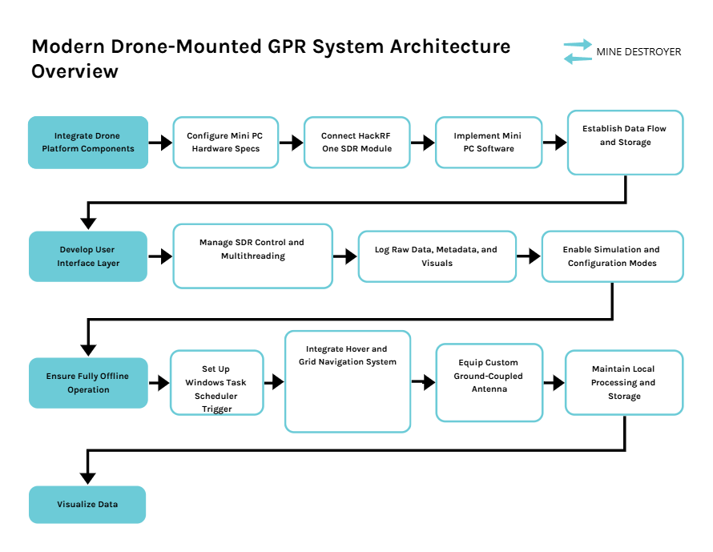

# 📡 MINE DESTROYER :Drone-Mounted GPR System Using HackRF One — Full Technical Specification

## 🧠 Project Overview

This project aims to develop a fully offline, drone-mounted Ground Penetrating Radar (GPR) system using a HackRF One Software Defined Radio (SDR) and a custom-built 47Ω antenna. The goal is to scan surface-level terrain to detect potential landmines based on RF signal reflections (Doppler shift or power increase). The system will use a Windows-based mini PC for signal control, data capture, and session management, with maximum utilization of CPU, RAM, and storage resources.

The application is built for **autonomous operation**, **offline deployment**, and **scientific data collection** — no processing or detection is done in real time. All raw signal data will be stored in a reproducible format for later analysis.

## 📦 System Summary

| Component      | Description                                                                 |
|----------------|-----------------------------------------------------------------------------|
| Drone Payload  | HackRF One, custom 47Ω antenna, Intel N150 mini PC, 8000mAh battery pack    |
| Mini PC Specs  | Windows 10/11, Intel N150, 16GB RAM, 512GB SSD                              |
| Power Budget   | ≤ 15W total draw for PC + HackRF (from drone battery)                      |
| Target Use     | Surface-level mine detection using RF reflection differences               |
| Signal Type    | RF transmission and reflection logging, 2.5–5 GHz sweep or fixed tone       |
| Antenna        | Custom-built, 47 Ohms, ground-coupled design                               |
| Connectivity   | HackRF via USB 2.0/3.0; no internet or external I/O                         |
| UI Design      | Minimalist UI (visible before and after scan only)                         |
| Mode           | Fully offline, auto-start, no operator during scanning                     |

## ✅ System Requirements

### Hardware Requirements

- HackRF One SDR
- Custom 47Ω antenna
- Windows mini PC with:
  - Intel N150 CPU
  - 16GB RAM
  - 512GB SSD
  - USB 2.0 or 3.0 ports
- 8000mAh power bank (shared between drone and PC)
- Drone with stable hover control (manual or auto)

### Software Dependencies

- Python 3.10+
- PySide6 (Qt for Python)
- `libhackrf.dll` (HackRF C API)
- `ctypes` (Python-C bridge)
- PyInstaller (for packaging)
- matplotlib / pyqtgraph
- NumPy
- Windows Task Scheduler
- Windows 10/11

## System Flow Diagram:


### Development Environment (Recommended)

- VS Code with Python & C extensions
- Git
- Python virtualenv
- HackRF utilities (`hackrf_transfer`)

## 🧰 Technology Stack

| Layer          | Technology                        |
|----------------|-----------------------------------|
| UI             | PySide6 / Qt for Python           |
| SDR API        | C via libhackrf.dll + ctypes      |
| App Logic      | Python 3.10+, multithreaded       |
| Data Storage   | .iq (binary) + .json + .csv       |
| Offline Mode   | Full `.exe`, no network needed    |
| Deployment     | PyInstaller                       |

## 🔁 Application Behavior

### 🟢 Startup Phase (Auto-Start Mode)

- Launch 1 minute after boot (Windows Task Scheduler)
- UI prompts for:
  - Field Length (m)
  - Field Breadth (m)
  - Grid Resolution (m)
  - Frequency Mode (Fixed or Sweep)
  - Duration per scan (ms)
- User confirms, scan begins

### 🔄 Scan Phase (Headless Mode)

- UI hides
- For each grid cell:
  - Set frequency
  - TX/RX for N ms
  - Buffer in RAM
  - Save `.iq` + `.json`
- Loop continues until field scan complete

### 🏁 Post-Scan Phase

- UI reappears
- Show 2D map or heatmap
- Export options:
  - Save data folder
  - Export `.csv` log
  - Export `.png` map
  - Restart or exit

## 📂 File Output Structure

```plaintext
gpr_session_YYYY_MM_DD/
├── config.json
├── scan_log.txt
├── summary.csv
├── scan_map.png
├── raw/
│   ├── cell_0_0.iq
│   ├── cell_0_0.json
│   ├── ...
```

### Metadata JSON Example

```json
{
  "cell_id": [3, 5],
  "timestamp": "2025-06-20T10:01:22Z",
  "frequency_hz": 3200000000,
  "duration_ms": 100,
  "sample_rate": 20000000,
  "file": "cell_3_5.iq"
}
```

## 🧠 Technical Design Highlights

### Memory/Resource Optimization

- Multithreading (UI, SDR control, capture, disk)
- Up to 512MB RAM buffering
- Full CPU use, minimized I/O blocking

### Data Accuracy & Integrity

- Raw I/Q samples
- Full metadata (freq, timestamp, grid)
- SHA256 checksum (optional)
- Simulation mode for dry-run

### Configurability

- `config.json` template
- Dynamic grid builder
- Sweep or fixed frequency
- Adjustable duration

## 🧪 Simulation Mode

- Generates synthetic `.iq` data
- Populate metadata
- Full offline testing (no HackRF needed)

## 🔐 Security & Offline Stability

- No telemetry or cloud
- No network required
- Works in air-gapped field systems
- No activation needed

## 👷 Development Plan

### Phase 1: SDR Communication Layer

- HackRF detection
- Frequency + TX/RX
- Data callback

### Phase 2: Buffer + Disk Architecture

- RAM buffer
- Chunked I/O
- JSON + CSV output

### Phase 3: UI Development

- Field input screen
- Scan end screen + map

### Phase 4: Packaging & Auto-Start

- PyInstaller `.exe`
- Scheduled task entry

### Phase 5: Testing + Simulation

- Synthetic data mode
- Structure + file validation

## 📣 Recruiter-Facing Project Summary

This project delivers a fully offline, high-accuracy, drone-mounted SDR-based GPR system. Designed to run autonomously, it controls a HackRF One SDR to emit RF pulses and log reflected signals for later landmine detection. It maximizes CPU/RAM resources of a mini PC, stores all data in scientific formats, and requires no internet or external processing. Ideal for field research, security, and robotics applications.

## 💬 Questions the System Answers

- Where are strong RF reflections indicating subsurface disturbance?
- What frequency ranges produce the clearest reflections on-site?
- How can raw I/Q data be stored per-grid for later ML or GPR analysis?

## 📎 Appendix

### Recommended Frequency Sweep

- Start: 2.5 GHz
- End: 5.0 GHz
- Step: 100 MHz

### Sample Rate

- 20 MSPS (HackRF performance)

### Timing Example

- Grid: 10m x 10m @ 0.25m = 1600 cells
- Duration: 100 ms per cell
- Total time: ~160 seconds
